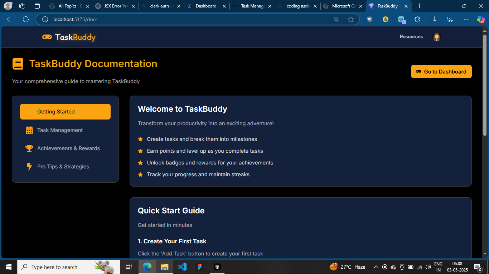

# TaskBuddy - Task Management For Lazy Genius

TaskBuddy is a modern, interactive task management application designed for people who struggle with task management. It provides a fun and engaging way to stay on track with your tasks through gamified badges, achievements and smooth animations.

# Live Demo

[Live Link](https://task-buddy-mk.vercel.app)

# Screenshots

| Landing Page | Dashboard |
|-------------|-------------|
|  |  |

| Dashboard 1 | Task History |
|-------------|-------------|
|  |  |

| Add Task Modal | Task Demo |
|-------------|-------------|
|  |  |

| Badges | Documentation |
|-------------|-------------|
|  |  |


## Features

- 🎯 Simple and intuitive task management
- 🎨 Clean and modern UI with smooth animations
- 🔒 Secure authentication with Clerk
- 💾 Local storage for persistent task data
- 🌙 Dark mode support
- 📱 Responsive design

## Getting Started

1. Clone the repository
2. Install dependencies:
   ```bash
   npm install
   ```
3. Create a `.env` file in the root directory and add your Clerk publishable key:
   ```
   VITE_CLERK_PUBLISHABLE_KEY=your_clerk_publishable_key_here
   ```
4. Start the development server:
   ```bash
   npm run dev
   ```

## Technologies Used

- React
- Vite
- Clerk (Authentication)
- GSAP (Animations)
- Framer Motion
- React Icons
- Tailwind CSS

## Contributing

Feel free to submit issues and enhancement requests!

## License

This project is an open-source project created by Mohd.Kaif.
